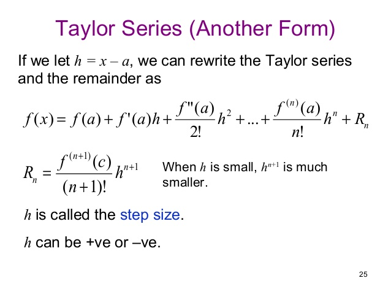

#Heat-Kernel
##Author's Orignal Files
- [heat-kernel source code](authors_original_files/src), 
- [pesonalized-pagerank source code](authors_original_files/ppr_src)
- [plotting utils](authors_original_files/plotting)
- [experiments](authors_original_files/experiments)
- [data](authors_original_files/data)
    
##Userful Source Codes
- [src](src_cpp_matlab)
- [python-src](src_python)    
    
##Theory 
- 